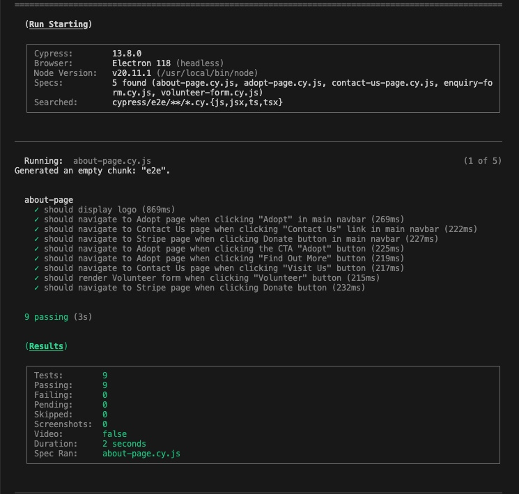
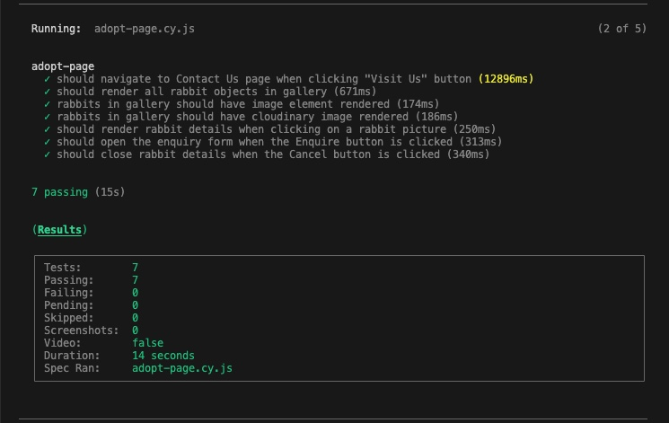
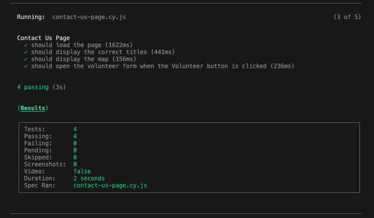
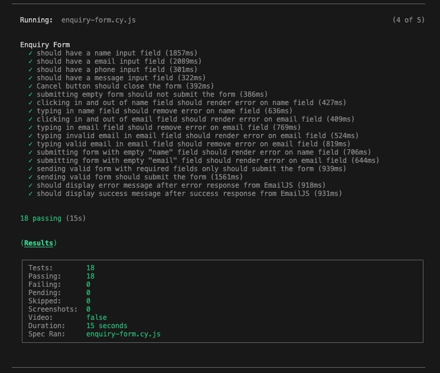
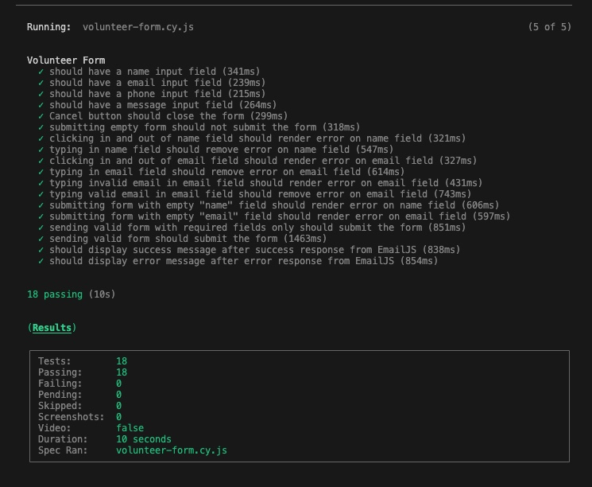
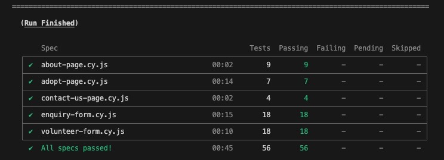
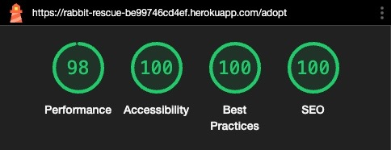
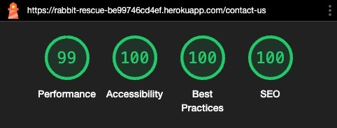

# Code Validation

[Deep Scan](https://deepscan.io) validates my code on every change on Github, ensuring that the results are always up-to-date:

# Unit Tests

## Unit tests for the Django Project

I wrote 16 unit tests for testing the django `models`, `serializers` and `views`. For the testing environment, I created a separate settings file: `settings_test.py`.

> To run the test in the development environment, run:
> `python manage.py test --settings=rabbit_rescue_REST.settings_test`

Results:

## Unit tests for the React Project

I used `Vitest (Jest)` to run unit and functional tests for the React Components. HTTP requests were mocked with the help of the [Mock Service Worker](https://mswjs.io/) library.

> To run these tests in development, run: 
> `npm test`

Results:

# End-to-end Integration Tests

> E2E Integration tests are implemented with Cypress.

To run the tests locally:

* run the backend server with `python manage.py runserver` in the backend folder,

* start the vite dev server in the frontend with `npm start` in the frontend folder,

* finally, run the Cypress test with: `npx cypress open`.

This will open up a new browser for Cypress, where we can start the test files and witness the process.

Alternatively, we can run it with a headless server, with: `npx cypress run`.

The results of these tests are shown below:

# Accessibility tests

* Accessibility tests were carried out on a Chrome / MacOS browser-device combination:

    * Tabs are working as expected on all pages.
    * Screen reader works as expected on all pages, with one minor issue, detailed in the [Known Bugs](#known-bugs) section.
* Colour contrasts were checked using [a11y Contrast Checker](https://color.a11y.com/Contrast/). All pages passed the tests:
    * [About Page Contrast Check Result](testing-images/a11y-contrast-about.pdf)
    * [Adopt Page Contrast Check Result](testing-images/a11y-contrast-adopt.pdf)
    * [Contact Us Page Contrast Check Result](testing-images/a11y-contrast-adopt.pdf)
* Further accessibility tests were done with Chrome Dev Tool's Lighthouse testing, [please see below](#lighthouse-tests).

- - -

# Lighthouse tests

Performance, Accessibility, Best Practices and SEO tests were carried out with [Google Dev Tools](https://developer.chrome.com/docs/devtools/)' **Lighthouse** tool in `Incognito` mode. 

Results:

| Page | Mode | Result for desktop | Result for mobile |
| :---: | :---: | :---: | :---: |
| About | light mode |  | |
| About | dark mode || |
| Adopt | light mode |  | |
| Adopt | dark mode || |
| Contact Us | light mode |  | |
| Contact Us | dark mode || |

- - -

# Bugs

## Resolved Bugs

* The screen reader could not convey meaning from some of the icons. 
    * Solution: aria-labels were added to all these icons' tags.
* Current page was wrongly identified by the sceen reader.
    * Solution: aria-current was corrected.
* Google Map's `<iframe>` was not changing colour in dark mode.
    * Solution: Properly customising the google maps iframe in dark mode would require an API_KEY which can not be safely embedded into HTML files, so dark-mode colours are achieved by just filtering the maps' colours in css. The `hue-rotate`, `invert` and `contrast` properties were set to achieve darker colours.

- - -
  

## Known Bugs

* When the screen reader is reading the `Adopt Page`'s main text, the reading stops before every highlighted text. I googled the issue, looked at local forums and asked advice on a specified slack channel, but found no solution. While this issue is an inconvenience, it does not block the availability of the content to the user.

